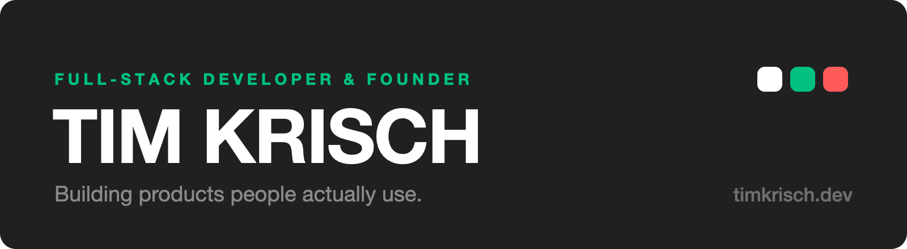
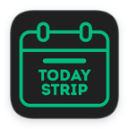
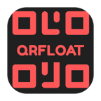

I build small, fast products people actually use — web and mobile, occasionally native macOS. Based in Germany. Currently building **[FellAkte](https://fellakte.de)**.

### Products

<table>
<tr>
<td><b><a href="https://fellakte.de">FellAkte</a></b></td>
<td>Health records for dogs and cats, with automated vaccination tracking</td>
<td>Flutter · Firebase · Cloud Functions · Node</td>
</tr>
<tr>
<td><b><a href="https://proofio.app">Proofio</a></b></td>
<td>Review intelligence — turning customer feedback into something a business can act on</td>
<td>Next.js · SwiftUI · Firebase · TypeScript</td>
</tr>
<tr>
<td><b><a href="https://hooktap.de">HookTap</a></b></td>
<td>Webhook push notifications for developers, with native macOS and Windows clients</td>
<td>Node · Firebase · SwiftUI</td>
</tr>
<tr>
<td><b>Spendory</b></td>
<td>Expense tracking for people who want personal finance to stay simple</td>
<td>Flutter · Firebase · Next.js</td>
</tr>
</table>

### Open source

Small, quiet macOS apps. No accounts, no analytics, MIT licensed.

<table>
<tr align="center" valign="top">
<td width="33%">
 
<b><a href="https://github.com/timk2003/Still">Still</a></b> 
A screensaver that shows the time and little else. Seven themes, a word clock, adaptive theming.
</td>
<td width="33%">
 
<b><a href="https://github.com/timk2003/TodayStrip">TodayStrip</a></b> 
One line in the menu bar showing whatever matters most right now. Join calls in one click.
</td>
<td width="33%">
 
<b><a href="https://github.com/timk2003/QRFloat">QRFloat</a></b> 
Detects QR codes on your displays and turns them into clickable floating overlays.
</td>
</tr>
</table>

### Working with

**Frontend** — TypeScript · React · Next.js · Tailwind · SwiftUI · Flutter

**Backend** — Node.js · Python · Firebase · Supabase · Postgres · Google Cloud

---

[timkrisch.dev](https://timkrisch.dev)
